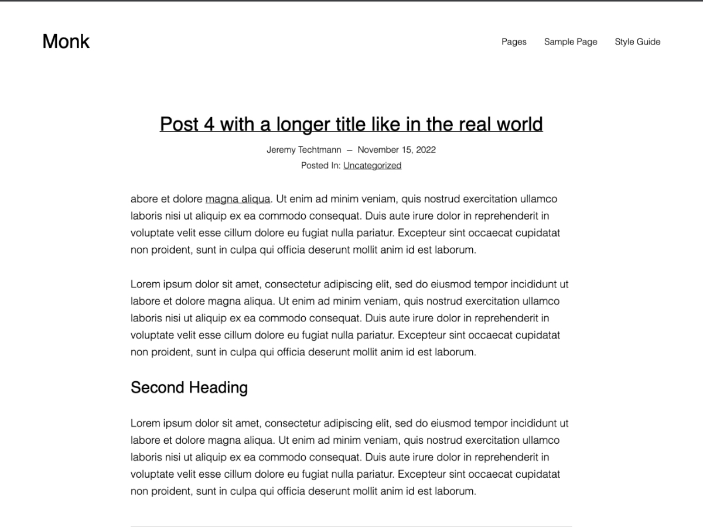

# Monk

An intentionally simple Site Editor base/starter theme built for WordPress.

Contributors: Jeremy Techtmann 
Requires at least: 6.0 
Tested up to: 6.0 
Requires PHP: 5.6 
Stable tag: 0.5.0 
License: GPLv2 or later 
License URI: http://www.gnu.org/licenses/gpl-2.0.html

## Features
No Patterns - Not even the default ones 
No Colors - White, Black, Dark Gray and Light Gray 
One Block Style - No bullets ul/ol

## Influenced by
Powder - https://github.com/bgardner/powder 
Davis Blocks - https://github.com/andersnoren/davis-blocks 
Wei - https://github.com/richtabor/wei 
Twenty Twenty-Three - https://github.com/WordPress/twentytwentythree 

### 0.5.0

Initial Release